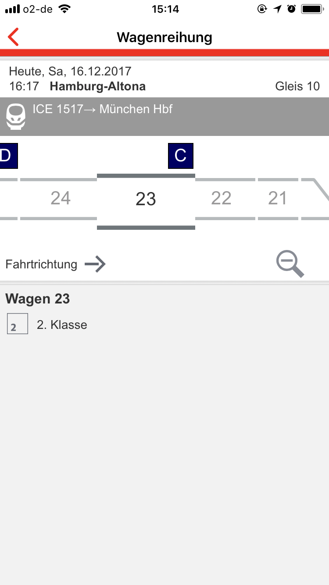

# WRP 

##Wagenreihungsplan

### Avoid the Wagenreihungsplan!

---

## Problem

---

---

---

---

--- 

---

---

---

---

---

---

---

---

## Better Approach

---

## We made some slides!

---

## Just kidding

### We built an app for iPhone.
### It changes everything.
### It even has an icon.

---

## Demo

---

## Main Features

- does its job
- uses coach sequence-data
- pretty simple
- works offline
- escalator-use-approved

---

## Sänk iu for lisning

---

https://github.com/zeitschlag/dbhackathon8

http://data.deutschebahn.com/dataset/data-wagenreihungsplan-soll-daten

Bildquelle: Internet

