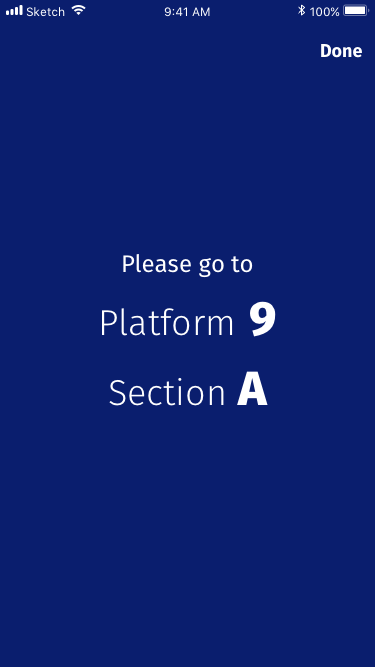

# WRP - Wagenreihungsplan

- A [dbhackathon8-project](https://dbmindbox.com/en/db-opendata-hackathons/hackathons/hackathon-8-db-open-data/)
- native mobile application for iPhone (and iPad, maybe.)
- Enter train number, train station, and wagon number for your reserved seat and get the section of the platform, where this wagon will be (well, at least where it should be according to the Wagenreihungsplan). Pretty simple.
- Avoid the printed Wagenreihungsplan at the platform, as there's almost always a crowd and use WRP - Wagenreihungsplan.
- This app uses [Wagenreihungsplan-Data](http://data.deutschebahn.com/dataset/data-wagenreihungsplan-soll-daten) from Deutsche Bahn ([CC BY 4.0](https://creativecommons.org/licenses/by/4.0/)) as well as [SWXMLHash](https://github.com/drmohundro/SWXMLHash) ([MIT license](https://github.com/drmohundro/SWXMLHash/blob/master/LICENSE))